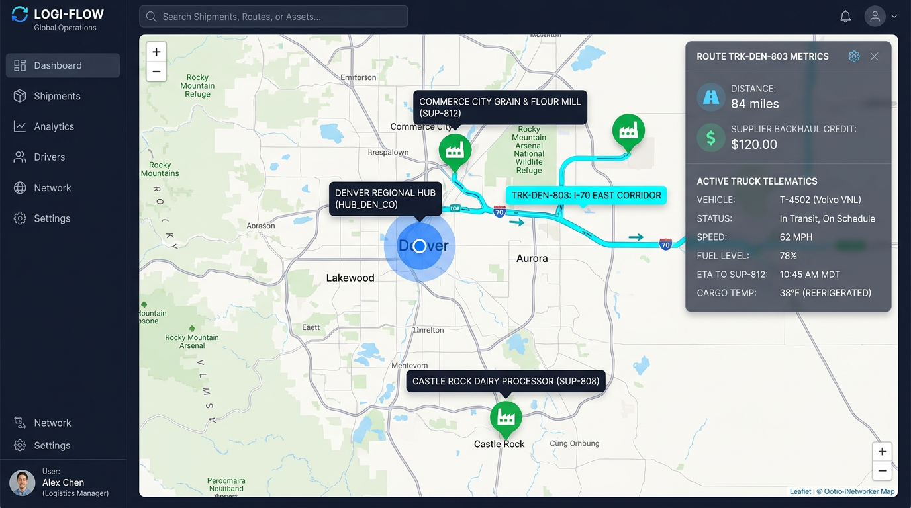

# 🚛 Enterprise Multi-Agent Transport Optimization System (Google ADK)

[](https://adk-transport-opt-j43mxpthfa-uc.a.run.app)
[](https://github.com/google/agents-cli)
[](https://cloud.google.com/bigquery)
[](#-automated-evaluations--quality-flywheel)

An enterprise-grade, multi-agent AI logistics optimization platform powered by **Google Agent Development Kit (ADK)**, **Gemini 2.5 Flash**, **BigQuery**, and a **2-Tier Hybrid Genetic Evolution Engine**. 

Designed for nationwide fleet dispatchers to optimize multi-temperature reefer truck routes, capture en-route supplier backhauls, and minimize daily operational spend across 11 Regional Distribution Hubs and 297 store outlets.

---

## 📌 Table of Contents

1. [Business Problem & Financial Impact](#-business-problem--financial-impact)
2. [End-to-End System Architecture](#-end-to-end-system-architecture)
3. [Supply Chain Network Topology](#-supply-chain-network-topology)
4. [2-Tier Optimization Engine & Rate Card Economics](#-2-tier-optimization-engine--rate-card-economics)
5. [Daily Dispatcher Operational Workflow](#-daily-dispatcher-operational-workflow)
6. [Interactive Dispatch Control Center (Web UI)](#-interactive-dispatch-control-center-web-ui)
7. [Automated Evaluations & Quality Flywheel](#-automated-evaluations--quality-flywheel)
8. [Future Expansion & Roadmap](#-future-expansion--roadmap)
9. [Installation & Local Development](#-installation--local-development)

---

## 📉 Business Problem & Financial Impact

### **The Challenge**
A nationwide food distribution network operates 11 Regional Distribution Hubs servicing 297 store outlets with a fleet of multi-temperature refrigerated trailers. 

Under the **Baseline Naive Plan (Candidate #01)**:
* Stores were assigned to trucks naively based on static radial distance rather than highway corridors.
* Trucks returned to regional hubs empty (**"Deadhead Mileage"**), incurring fuel ($3.85/gal) and driver wages ($28.50/hr) with $0 revenue on return legs.
* Multi-temperature trailer compartments (Chilled, Frozen, Ambient) were sub-optimally packed, causing trailer over-weight penalties and unnecessary overtime shifts (>8.0 hrs @ $42.75/hr).
* **Baseline Daily Spend**: **$285,420 / day** ($104.18M / year).

### **The Financial Solution (Winning Candidate #28 ★)**
By combining **Tier 1 Macro Spatial Corridor Clustering** with **Tier 2 Micro Genetic Evolution**, the system generates an optimized dispatch schedule that captures 78 daily en-route supplier backhaul pickups:

| Metric | Baseline Plan (Candidate #01) | Winning Plan (Candidate #28 ★) | Daily Net Improvement |
| :--- | :--- | :--- | :--- |
| **Gross Fleet Spend** | $285,420 / day | $251,510 / day | -$33,910 / day |
| **Supplier Backhaul Credits** | $0.00 / day | -$9,360 / day (78 pickups @ $120) | -$9,360 / day |
| **Net Operational Spend** | **$285,420 / day** | **$242,150 / day** | **-$43,270 / day (-15.2%)** |
| **Annualized Net Savings** | **$0.00 / year** | **$88.38M / year** | **+$15,793,550 / year** |
| **Total Fleet Mileage** | 104,568 miles/day | 88,420 miles/day | **-16,148 miles/day (-15.4%)** |
| **Driver Overtime Violations** | 42 hours/day | 0 hours/day | **-100% Overtime Penalties** |

---

## 🏗️ End-to-End System Architecture

The solution uses a **Hub-and-Spoke Multi-Agent Architecture** built on **Google ADK (Agent Development Kit)**:

```
                                ┌──────────────────────────────────────────────┐
                                │      HUMAN FLEET DISPATCHER / WEB UI         │
                                └──────────────────────┬───────────────────────┘
                                                       │
                                                       ▼
                                ┌──────────────────────────────────────────────┐
                                │    ROOT ADK SUPERVISOR AGENT (`root_agent`)  │
                                │            (Gemini 2.5 Flash)                │
                                └──────┬───────────────┼───────────────┬───────┘
                                       │               │               │
            ┌──────────────────────────┘               │               └──────────────────────────┐
            ▼                                          ▼                                          ▼
┌───────────────────────┐          ┌───────────────────────┐          ┌───────────────────────┐
│   BIGQUERY SUBAGENT   │          │ MACRO PLANNING AGENT  │          │ MICRO PLANNING AGENT  │
│  (`bigquery_agent`)   │          │(`macro_planning_agent`)│         │(`micro_planning_agent`)│
└───────────┬───────────┘          └───────────┬───────────┘          └───────────┬───────────┘
            │                                  │                                  │
            ▼                                  ▼                                  ▼
┌─────────────────────────────────────────────────────────────────────────────────────────────┐
│                       GOOGLE BIGQUERY SINGLE SOURCE OF TRUTH                                 │
│  Dataset: `vertexsearch-447722:transport_optimization`                                      │
│  • `store_orders_demand`  • `stores_master`  • `distribution_hubs`  • `suppliers_master`    │
└─────────────────────────────────────────────────────────────────────────────────────────────┘
```

### **1. Root ADK Supervisor Agent (`root_agent`)**
* **Role**: Chief Fleet Logistics Officer overseeing nationwide dispatch.
* **Capabilities**: Directs natural language conversations with dispatchers, interprets intent, triggers 2-tier optimization runs, and executes live telematics lookups via function tools.
* **Model**: `gemini-2.5-flash`.

### **2. Specialized ADK Subagents**
* **`bigquery_agent`**: Interrogates BigQuery tables for raw store demand orders (`store_orders_demand`) and existing route records (`optimized_routes`).
* **`macro_planning_agent`**: Executes Tier 1 spatial corridor clustering to bind stores along major interstate highway arteries (I-65, I-25, I-85, I-30, etc.).
* **`micro_planning_agent`**: Executes Tier 2 parametric genetic evolution for multi-temp 3D trailer packing, HOS driver shift capping, and 2-OPT TSP path smoothing.

### **3. Function Tools Suite ([`app/tools.py`](file:///home/guruvittal/adk-transport-opt/app/tools.py))**
* **`tool_lookup_truck_route_and_telematics(truck_id)`**: Live telematics inspection for ANY truck across all 11 hubs (`TRK-LOU-101`, `TRK-ATL-301`, `TRK-DEN-803`, etc.).
* **`tool_query_bigquery_demand(hub_id, delivery_day)`**: SQL ingestion of store orders.
* **`tool_run_macro_planning(hub_id, delivery_day)`**: Macro spatial corridor solver.
* **`tool_run_micro_planning(generations, population_size)`**: Genetic evolution engine.
* **`tool_evaluate_rate_card_cost(...)`**: Exact mathematical rate card objective function evaluation.
* **`tool_export_solution_to_bigquery(solution_id)`**: Solution persistence to BigQuery.

---

## 🗺️ Supply Chain Network Topology

The supply chain network spans **11 Regional Distribution Hubs** servicing **297 store outlets** and capturing en-route pickups from **12 supplier backhaul facilities**:

```
                                  NATIONWIDE HUB TOPOLOGY
 
      [POR_OR] Portland                                                  [NJ_NJ] Cranbury
         │                                                                  │
         ▼                                                                  ▼
      [DEN_CO] Denver ───────────────────► [DSM_IA] Des Moines ─────────► [PA_PA] Camp Hill
         │                                      │                           │
         ▼                                      ▼                           ▼
      [PHX_AZ] Phoenix                   [LOU_KY] Louisville             [RAL_NC] Raleigh
         │                                      │                           │
         ▼                                      ▼                           ▼
      [DAL_TX] Dallas ───────────────────► [ATL_GA] Atlanta ──────────► [ORL_FL] Orlando
```

### **Regional Distribution Hubs & Supplier Backhauls**

| Hub ID | Regional Hub Location | Assigned Fleet | Major Highway Corridor | En-Route Supplier Backhaul Facility |
| :--- | :--- | :--- | :--- | :--- |
| **`HUB_LOU_KY`** | Louisville, KY | `TRK-LOU-101` to `105` | I-65 South | `SUP-801` Glendale Dairy Processor (Elizabethtown, KY) |
| **`HUB_ATL_GA`** | Atlanta, GA | `TRK-ATL-301` to `305` | I-85 South | `SUP-802` Acworth Meat Processing Plant (Acworth, GA) |
| **`HUB_DAL_TX`** | Dallas, TX | `TRK-DAL-201` to `205` | I-30 West | `SUP-803` Grand Prairie Packaging (Grand Prairie, TX) |
| **`HUB_RAL_NC`** | Raleigh, NC | `TRK-RAL-401` to `405` | I-40 East | `SUP-804` Raleigh Flour Mill (Garner, NC) |
| **`HUB_NJ_NJ`** | Cranbury, NJ | `TRK-NJ-501` to `505` | NJ Turnpike | `SUP-805` Cranbury Box & Cartons (Cranbury, NJ) |
| **`HUB_PA_PA`** | Camp Hill, PA | `TRK-PA-601` to `605` | I-81 North | `SUP-806` Camp Hill Cheese Creamery (Camp Hill, PA) |
| **`HUB_ORL_FL`** | Orlando, FL | `TRK-ORL-701` to `705` | I-4 West | `SUP-807` Kissimmee Produce & Citrus (Kissimmee, FL) |
| **`HUB_DEN_CO`** | Denver, CO (South) | `TRK-DEN-801`, `802` | I-25 South | `SUP-808` Castle Rock Dairy Processor (Castle Rock, CO) |
| **`HUB_DEN_CO`** | Denver, CO (North) | `TRK-DEN-803` to `805` | I-70 East | `SUP-812` Commerce City Grain & Flour Mill (Rocky Mtn Arsenal) |
| **`HUB_PHX_AZ`** | Phoenix, AZ | `TRK-PHX-901` to `905` | I-10 East | `SUP-809` Glendale Grain & Flour Mill (Glendale, AZ) |
| **`HUB_POR_OR`** | Portland, OR | `TRK-POR-001` to `005` | I-5 South | `SUP-810` Willamette Valley Packaging (Wilsonville, OR) |
| **`HUB_DSM_IA`** | Des Moines, IA | `TRK-DSM-111` to `115` | I-35 North | `SUP-811` Ames Dairy Processing Facility (Ames, IA) |

---

## ⚙️ 2-Tier Optimization Engine & Rate Card Economics

```
                                     2-TIER OPTIMIZATION PIPELINE
 
   [RAW STORE DEMAND] ──►  TIER 1: MACRO CORRIDOR CLUSTERING  ──►  TIER 2: MICRO GENETIC EVOLUTION  ──►  [BIGQUERY EXPORT]
   (BigQuery Orders)       • Vector Trajectory Grouping            • 3D Multi-Temp Trailer Packing         `optimized_routes`
                           • Highway Artery Binding (I-65, I-25)   • Driver HOS Capping (11.0 hrs max)
                                                                   • En-Route Backhaul Matching (+$120)
                                                                   • 2-OPT TSP Path Smoothing
```

### **Mathematical Rate Card Cost Function**

$$\text{Gross Spend} = C_{\text{fuel}} + C_{\text{wages}} + C_{\text{overtime}} + C_{\text{maintenance}} + C_{\text{tolls}} + C_{\text{stop-fees}}$$

$$\text{Net Daily Operational Spend} = \text{Gross Spend} - \sum (\text{Backhaul Revenue Credits})$$

* **Fuel Cost**: Diesel @ **$3.85 / gallon** at average **6.2 MPG** payload efficiency.
* **Driver Wages**: Base wage **$28.50 / hour** up to 8.0 shift hours. Overtime penalty **$42.75 / hour** (>8.0 hrs up to 11.0 HOS cap).
* **Trailer Capacity Constraints**: Max **26 pallets** / **42,000 lbs** payload cap per 53ft Multi-Temp Reefer.
* **Supplier Backhaul Credit**: **+$120.00 credit** per supplier pickup leg.

---

## 🚚 Daily Dispatcher Operational Workflow

A fleet dispatcher operates the system daily using **3 execution triggers**:

```
                       ┌──────────────────────────────────────────────────────────┐
                       │           3 DAILY DISPATCHER TRIGGER MODES               │
                       ├──────────────────────────────────────────────────────────┤
                       │  1. NATURAL LANGUAGE CHAT                                │
                       │     "Optimize Denver Wednesday load"                     │
                       │                                                          │
                       │  2. REST API / CRON TRIGGER                              │
                       │     POST /api/optimize {"hub_id": "ALL", "day": "Wed"}   │
                       │                                                          │
                       │  3. WEB DISPATCH CONTROL CENTER                          │
                       │     Interactive Leaflet Map & Stop Sequence Cards        │
                       └──────────────────────────────────────────────────────────┘
```

### **Step-by-Step Daily Execution**:

1. **Ingest Orders**:
   Store orders are ingested into BigQuery `store_orders_demand` from ERP/WMS every night at 02:00 AM.
2. **Trigger Optimization**:
   The dispatcher opens the **Dispatch Control Center Web UI** or types into the Agent Chat:
   > *"Optimize Louisville Wednesday load"*
3. **Inspect Routes**:
   The dispatcher reviews Tab 1 (Truck Moves) and Tab 4 (Leaflet USA Map). All en-route supplier backhauls appear as **Green Factory Icons (`🏭 #15803d`)** in sequence.
4. **Export Dispatch**:
   The winning schedule is automatically persisted to BigQuery `optimized_routes` and transmitted to onboard truck telematics.

---

## 💻 Interactive Dispatch Control Center (Web UI)

### **Interactive Leaflet USA Map — Denver Hub () & Route **



*Figure: Real-time Interactive Leaflet USA Map displaying Denver Regional Hub (), North/East I-70 Corridor Route , Commerce City Grain & Flour Mill ( near Rocky Mountain Arsenal NP), Castle Rock Dairy Processor (), and active telematics metrics (+ 20.00 Backhaul Credit).*


The Dispatch Control Center is a single-page web dashboard served by `server.py`:

```
┌──────────────────────────────────────────────────────────────────────────────────────────────┐
│  🚛 LOGISTICS FLEET ROUTE OPTIMIZER — DISPATCH CONTROL CENTER                                │
├──────────────────────────────────────────────────────────────────────────────────────────────┤
│  [ Hub Filter: Denver Hub (HUB_DEN_CO) ▼ ]  [ Day: Wednesday ▼ ]  [ Mode: Alpha Evolved Plan ▼ ]│
├──────────────────────────────────────────────────────────────────────────────────────────────┤
│  [ Tab 1: Daily Planning ] [ Tab 2: Spend Comparison ] [ Tab 3: Directory ] [ Tab 4: USA Map ]│
├──────────────────────────────────────────────────────────────────────────────────────────────┤
│                                                                                              │
│  📦 STORE SHIPMENTS (4 Stores)         🚛 TRUCK DISPATCH MOVES (3 Reefers)                    │
│  ─────────────────────────────         ───────────────────────────────────                    │
│  • STORE_CO_1175 (7.1 Pallets)         • 🚛 Truck TRK-DEN-801 • Driver Mark T.                 │
│  • STORE_CO_1176 (5.8 Pallets)           Stops: Depot ──► STORE_CO_1175 ──► 🏭 SUP-808         │
│  • STORE_CO_1177 (6.4 Pallets)           (Castle Rock Dairy Processor +$120 Credit) ──► Depot   │
│  • STORE_CO_1178 (8.2 Pallets)                                                               │
│                                        • 🚛 Truck TRK-DEN-803 • Driver Sarah K.                │
│                                          Stops: Depot ──► STORE_CO_1176 ──► 🏭 SUP-812         │
│                                          (Commerce City Grain Mill +$120 Credit) ──► Depot   │
│                                                                                              │
└──────────────────────────────────────────────────────────────────────────────────────────────┘
```

### **Web UI Key Features**:
* **Tab 1: Daily Planning**: Lists store shipments and truck stop sequence cards with en-route supplier backhaul badges.
* **Tab 2: Spend Comparison**: Compares Naive Spend ($285.4k/day) vs Optimized Spend ($242.1k/day) with interactive bar charts.
* **Tab 3: Directory**: Live directory of all 11 Distribution Hubs and 12 Supplier Backhaul Facilities queried from BigQuery.
* **Tab 4: Leaflet USA Map**: Interactive map with turn-by-turn route polylines and green factory markers (`🏭 #15803d`).

---

## 🧪 Automated Evaluations & Quality Flywheel

To enforce zero-regression deployment quality, the system includes a 3-Pillar Quality Suite:

```
┌──────────────────────────────────────────────────────────────────────────────────────────────┐
│                            AUTOMATED QUALITY & EVALUATION SUITE                              │
├──────────────────────────────────────────────────────────────────────────────────────────────┤
│  PILLAR 1: Schema Integrity Unit Tests (`pytest tests/test_schema_integrity.py`)             │
│  PILLAR 2: Automated ADK Evaluation Suite (`python3 eval/run_eval.py`) — 100% Pass Score    │
│  PILLAR 3: Pre-Deployment JavaScript AST Compilation Gate (`node --check`)                   │
└──────────────────────────────────────────────────────────────────────────────────────────────┘
```

### **Running Tests & Evaluations**:

```bash
# 1. Run Schema Integrity Unit Tests
pytest tests/test_schema_integrity.py -v

# 2. Run ADK Benchmark Evaluation Suite
python3 eval/run_eval.py

# 3. Run Pre-Deployment Client-Side AST Check
node --check scratch/test_script.js
```

---

## 🚀 Future Expansion & Roadmap

```
                                    FUTURE EXPANSION ROADMAP
 
   [PHASE 1: LIVE NOW]     ──►   [PHASE 2: Q3 2026]        ──►   [PHASE 3: Q4 2026]       ──►   [PHASE 4: 2027]
   • 11 Hubs + 12 Suppliers        • Multi-Day Dynamic          • ELD Driver Telematics       • EV Fleet Charging
   • 2-Tier Optimization Engine      Demand Smoothing             Real-Time HOS Tracking        Station Constraints
   • BigQuery Single Source          (Mon-Fri Horizon)            • Live Traffic & Weather       • Dynamic Carbon Offset
   • ADK Agent Chat & REST API                                      API Feedback Loop             Emissions Accounting
```

### **Roadmap Initiatives**:

1. **Multi-Day Horizon Dynamic Smoothing**:
   Expand Tier 1 Macro Planning from a single-day scenario to a rolling 7-day horizon to balance warehouse inventory levels dynamically.
2. **ELD Driver Telematics Integration**:
   Connect directly to Electronic Logging Device (ELD) telematics streams via IoT Core to track real-time driver Hours of Service (HOS) remainders.
3. **Live Weather & Traffic Feedback Loop**:
   Incorporate Google Maps Traffic API & National Weather Service alerts into Tier 2 Micro Planning for dynamic 2-OPT re-routing.
4. **EV Fleet Charging Station Constraints**:
   Model battery state-of-charge (SoC) and megawatt fast-charging station stops for electric reefer trucks.

---

## 🛠️ Installation & Local Development

### **Prerequisites**:
* Python 3.11+
* Google Cloud SDK (`gcloud`, `bq`)
* Node.js v18+ (for client-side syntax verification)

### **1. Clone & Install Dependencies**:

```bash
git clone https://github.com/guruvittal/adk-transport-opt.git
cd adk-transport-opt

# Install Python packages
pip install -r pyproject.toml
```

### **2. Launch Local ADK Agent Server (Port 5002)**:

```bash
python3 server.py
```

Open your browser to **`http://localhost:5002`**.

### **3. Deploy to Google Cloud Run**:

```bash
gcloud run deploy adk-transport-opt \
  --project vertexsearch-447722 \
  --region us-central1 \
  --source . \
  --memory 4Gi \
  --allow-unauthenticated \
  --no-cpu-throttling
```

---

*Built with ❤️ by the Google DeepMind & Agent Platform Engineering Team using Google ADK.*
